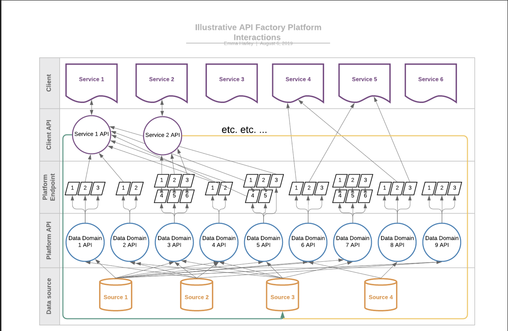
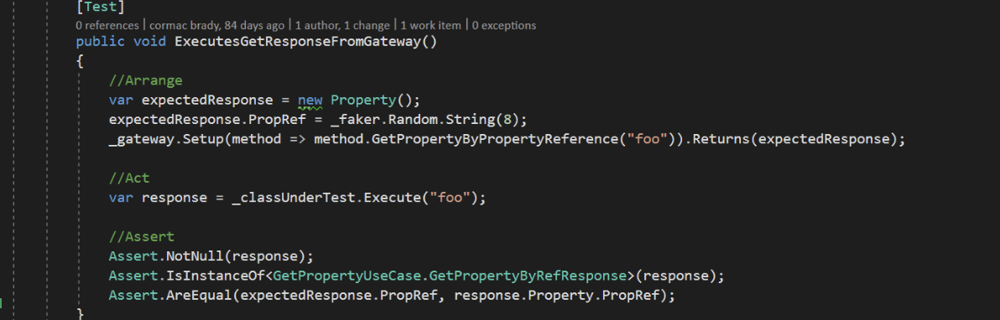
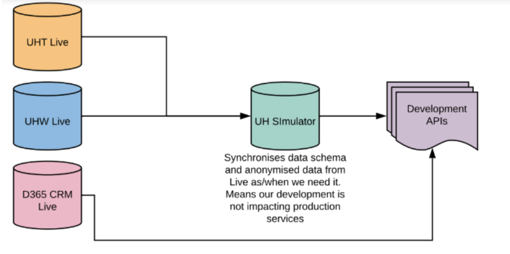
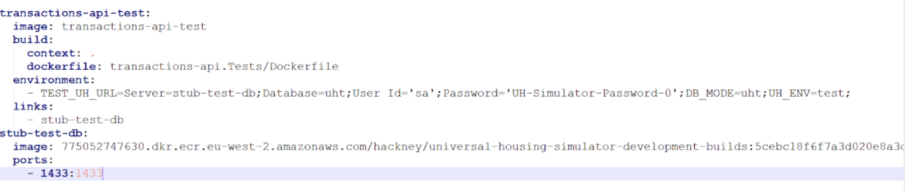
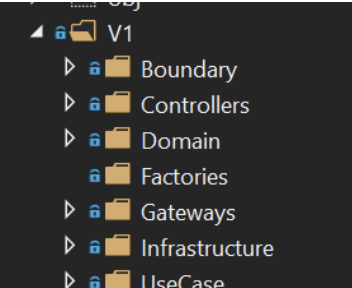
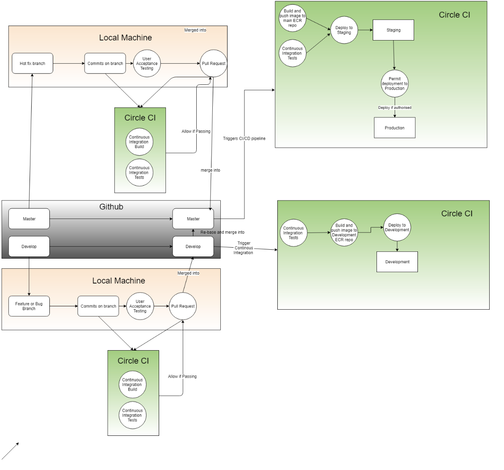
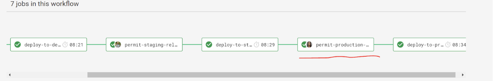
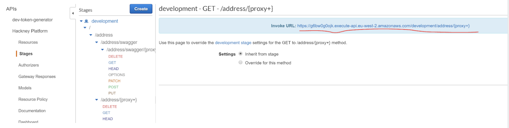
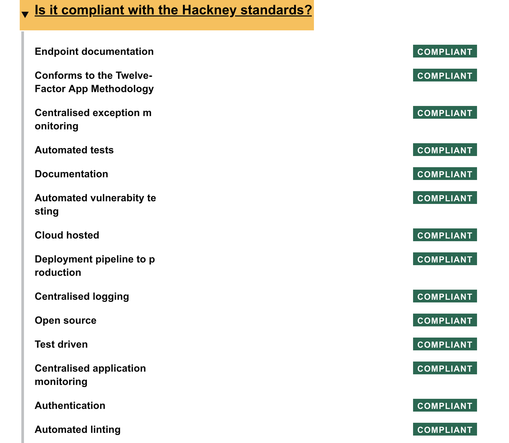

# Welcome to the API-Playbook-v2 - [beta version]

## API Implementation Guide - Playbook v2

### Product Owner
* Rashmi Shetty [rashmi.shetty@hackney.gov.uk]

Contents

- [Introduction](#introduction)
  - [When to write an API](#when-to-write-an-api)
  - [Establishing the user need](#establishing-the-user-need)
- [Designing your API](#designing-your-api)
- [Building your API](#building-your-api)
     - [API Standards](#api-standards)
- [Development approach](#development-approach)
   - [Boilerplate Code](#boilerplate-code)
   - [Containerisation](#containersation)
   - [TDD - Test Driven Development](#test-driven-development)
     - [How to write good TDDs](#how-to-write-good-TDDs)
   - [Working with housing data - Universal housing simulator](#universal-housing-simulator)
   - [Folder Structure](#folder-structure)
   - [End-to-end testing](#end-to-end-testing)
- [Hosting](#hosting)
   - [Current infrastructure architecture](#current-infrastructure-architecture)
   - [Infrastructure as code](#infrastructure-as-code)
   - [ECS](#ecs)
   - [API Gateway](#api-gateway)
   - [Monitoring tools](#monitoring-tools)
      * [Centralised logging](#centralised-logging)
      * [Centralised application performance monitoring](#centralised-application-logging)
      * [Centralised uptime monitoring](#centralised-uptime-monitoring)
- [Deploying your API](#deploying-your-api)
    - [CI/CD Pipeline](#ci-cd-pipeline)
    - [Pre-deployment](#pre-deployment)
    - [Our deployment pipeline](#our-deployment-pipeline)
       - [Branching](#branching)
       - [Automated deployment](#automated-deployment)
    - [Our deployment pipeline](#our-deployment-pipeline)
    - [End-to-end Testing (Post-deployment)](#end-to-end-testing)
       - [Pre-requirements](#pre-requirements)
- [CheckList](#checklist)
- [Making decisions about APIs](#making-decisions)

## Introduction

We have two types of API in Hackney: a set of ‘platform APIs’ which present master data about our people and properties and ‘service APIs’ that provide the information required to enable the delivery of a digital service to our residents and businesses. 

In other words Platform APIs are data-driven, domain modelled which are built with reusability in mind where as Service APIs are specific to given service which Platform APIs are unable to cater. These service APIs will directly extract data from specific datasource when required. We require Platform APIs to be as generic as possible in order to meet the needs for services and at the same time to be reusable and consistent. 

We’ve reached this position after exploring different levels of granularity for our APIs and determining that this is the optimum model for:

1. Accelerating development
2. Reducing duplication
3. Providing a single version of the truth

APIs can be written by any person or agency working under contract to the London Borough of Hackney. Platform APIs are managed by the API Platform Product Owners whilst service APIs are the responsibility of the application manager or software vendor that is responsible for the service. 

The image below illustrates the target architecture: 

We’ve written about [what we’ve learnt about APIs](https://docs.google.com/document/d/10C2Ly0uhZ35g-p1215rJhKoRtWkKns5ax2gWOkGDglA/edit) and why we’ve adopted this approach. 

### When to write an API

We want our data to be available via REST API wherever there is a user need. We are prioritising making data available via APIs where:
1. Existing line of business applications enable us to develop APIs
2. Data is required by two or more systems, so APIs enable more reliable, secure methods of data sharing
3. APIs enable us to reduce dependence on one particular solution and develop new services better to meet user needs

### Establishing the user need

Before we write an API we need to establish the user need. Typically, we do this in a Discovery phase when we’re exploring the opportunity to use technology and data to better meet the needs of our residents. Our discovery phase should identify:

* What data we currently hold, where, who needs it and how it’s used
* The lawful basis for processing this data and any consideration we need to give to privacy impact
* Whether there are existing APIs that we can re-use
* Any dependencies on data / reporting / MI with other teams

We typically record the user need through user stories, but this can be decided by individual teams. A prototyping phase might experiment with a stub API so that we can validate the user need. 

**_Example user story_**

**_"As an application developer, I need to be able to retrieve addresses added, deleted or modified in the property gazetteer between 2 dates so that I am assured the data we have is current"._**

On occasion, we will identify a user need for a platform API that hasn’t yet been fulfilled. This may mean we need to develop an API without a full understanding of the user need, meaning this will need to be iterated subsequently. The API Platform Product Owner makes these decisions on a case-by-case basis, in collaboration with the delivery managers and Data and Insight Manager. 

## Designing your API

We have provided advice and guidance on how to design your API: 
[Design your API](https://github.com/LBHackney-IT/API-Playbook/blob/master/api-guidelines/design-principles.md)

## Building your API

### API Standards

Your API will need to meet the following standards for it to be accepted into service:
1. There is clear evidence of user need - the API provides the data needed to power one or more digital services.
2. Publish your code in the open and use open source code to improve transparency, flexibility and accountability. When re-using code ensure that we benefit from the community that support it.
3. The service meets security guidelines, minimises data collection and reuses existing data to avoid duplication of datasets. You have permission to use the data for this purpose and the approach to access management is consistent with that permission.
4. You have identified the capacity, resources and technical flexibility to iterate and improve the service frequently.
5. Work out what success looks like for your service and identify metrics which will tell you what’s working and what can be improved, combined with user research (uptake, calls per hour, availability).
6. Optimise for performance, minimise service downtime and have a plan to deal with it when it does happen.
7. Your API is clearly documented, meets our API design principles and naming conventions and has a named Product Owner.
8. You have identical staging and production APIs 
9. You have a clear and secure method of managing access, keys, authentication, users and versioning
10. The API is developed to the principles in the Playbook and any exceptions have been agreed in advance

## Development approach

###  Boilerplate Code

**Principle: Re-use our boilerplate code unless you can provide clear reasons it doesn’t meet your needs.**

A template is provided on Github that forms the basis for all APIs. This base API contains all the tools to get you up and running quickly, so the first task in the development of any API is to fork the Base API Repo (https://github.com/LBHackney-IT/lbh-base-api) and update to your project name:

* Main project and test project folders.
* Namespaces in the .cs files (The Namespaces shouldn’t contain dash symbols as it prevents the project from compiling - replace them with underscores. Ex.: “property_api” rather than “property-api”.)
* Project mentions in the dotnet csproj files for project and test solution.
* Project mentions in the docker-related files and CircleCI configuration.
* Create a public GitHub repo. (ensure no secrets are submitted)

Currently the above boilerplate is created .net core however going forward we will be creating other boilerplates in different languages.

###  Containerisation

**Principle: use containerisation unless there’s clear evidence it’s not right for your service.**

All APIs are run in a containerised environment, each solution (main and tests) do contain a The docker entry point is the docker-compose file and with its current setup it allows to build the project alongside an instance of the UH simulator. The Docker file contained in the base API should be updated to reflect the details of the project it is being used for. More information on how we use [Docker](https://docs.google.com/document/d/16HyKtQtUBjz-W9HwIPF4T-CnSe1m8poqCilRtRohZmQ/edit#heading=h.6jjvle8n1rck)

For an example of using Docker with .NET Core, see the [Tenancy API] https://github.com/LBHackney-IT/LBHTenancyAPI.

For an example of using Docker with Ruby, see the [Income API] https://github.com/LBHackney-IT/lbh-income-api.

### TDD - Test Driven Development

**Principle: use automated testing to ensure your features are fully tested and dependencies are identified.**

We use the Test Driven Development methodology when writing new code, as it makes it easier to build functionality progressively, helps reduce error rate in production, and helps prevent against feature regressions after changes. We use Clean Architecture principles which allows us to easily test each unit of our applications.
 
* How to write good TDDs

    * Always follow the triple ‘A’ structure - Arrange, Act, Assert [AAAs]

The tests you write should drive the code produced, not the other way around - You should always first write the test, see it fail and then write the minimal necessary code to make it pass. Then you can work on refactoring it while making sure the test keeps passing. This ensures that all code written has test coverage. 

   * We use currently nUnit and Moq frameworks for TDD however we welcome other frameworks as well such as xUnit,MSTest etc for .net core.
       * Tests per class need to cover both ‘happy’ and ‘sad’ scenarios
       * Tests that need to be included are (but not limited to):
       * Test for a successful, populated response.
       * Test for a successful, empty response.
       * Test for a scenario when exception is thrown.

### Working with housing data (Universal housing simulator)

A simulated testing version of UHT and UHW live databases - the integrated housing management application - is available for developers. The purpose of the simulator is to provide a mirror of the UH database structure and schema. It is used for testing purposes so we wouldn’t interact with the actual UHW and UHT database.
 
)

The project produces two versions:
     * an empty one, used as part of TDD 
     * a ‘loaded’ one containing real anonymised data

Those versions are saved in images in an ECR repository.  The docker-compose.yml file specifies the image that the given API is pointing to. Example is provided below:

)

**_We always specify the image tag after the name of the repository_**. Not doing so would make your API use the latest available image, which might have breaking changes. 

When you run docker-compose up command locally, docker spins up both the API and the UH simulator database that is used throughout testing

Once APIs are deployed to our development environment, we use an AWS RDS version of the UH simulator. 

* It's populated UH simulator with real anonymised data
* To use that version, the correct connection string needs to be provided in the ‘Parameter Store’.

The UH simulator DB was produced and maintained via a Ruby project. More on how it works can be found here.  

### Folder structure

_Principle: Structure your APIs in this way so that Hackney can support them, unless there is good reason not to._

Based on this Clean Architecture methodology, our project folders are structured in the following way: 

* **Boundary**
     * Holds classes specifying the request and response objects of the API.

* **Controllers** 
     * Holds the controller classes
        * By default, BaseController.cs and HealthCheckController.cs should be included in your project
* **Domain**
     * Holds the model class defining the domain object returned to the consumer of the API 

* **Gateway**
     * Holds the class responsible for establishing connection with the data source and retrieving/inserting/updating data queries to perform the given action against the data source 

* **Infrastructure**
     * Holds the model classes representing the domain object as it is in the data source

* **Use Cases** 
     * Holds the classes responsible for invoking the gateway logic and doing any data pre and post-processing before returning it to the controller

All of the above classes are grouped per version. (e.g. all of the above folders are under a ‘V1’ parent folder)

)

* **Tests**
   The folder hierarchy of the test project should closely match that of the main project folder.  For each of the classes created for the project there should be a corresponding suite of tests.

)

### End-to-end testing (pre-deployment)

_Principle: Tests are automated wherever possible including smoke testing, regression testing, lint testing, contract testing._

All API solutions need to include end-to-end integration tests. The purpose of those is to test the functionality against real (anonymised) data, coming from a local or remote instance of UH simulatoral DB. 

When testing against a local instance of the simulator, we are inserting fake data and testing against it. This means that we are testing against data that we had control over.

Testing against real anonymised data will provide confidence in the sturdiness of the APIs built and will ensure that every scenario is covered.

By default, building the project via docker-compose will create images of the project itself and the UH simulator loaded with anonymised data. We are also exploring with the idea of using a single instance of the UH Simulator hosted in RDS, though both methods of accessing the data source would be equivalent in terms of functionality.

## Hosting

_Principle: The API is hosted by Hackney’s AWS account unless there is a good reason not to._

Current infrastructure [Architecture](https://docs.google.com/document/d/1xmn82dGiubC9oX7AqSO6Ieo6OWJVphT_Qp55kdQBkuc/edit)

**1. Infrastructure as code**

Our API infrastructure is deployed in AWS and we manage it using the Infrastructure as a code tool Terraform. We have a private Github repository with our Terraform project so new additions or modifications to our infrastructure should be worked out using it. More information on the Terraform project [Terraform](https://docs.google.com/document/d/1aUE7VnMvfvbDYVp5Kb8f6D0ALvXidkU4Gbbx4FEY2Cw/edit)

**2. ECS**

We use ECS on AWS to run Docker containers in the cloud. This allows us to use the same Docker containers we use in development, for actually serving in production. ECS orchestrates deployments of new images, running them on our own EC2 machines. ECS is a fairly simple and cost effective approach to running Docker in production, and allows us to run containers within our AWS VPC, which has a VPN connection to the Hackney network. It can also be securely connected to our AWS API Gateway without making the EC2 instances public, meaning they are more secure.

Currently we are using terraform to setup the new applications on ECS. For more details please read ‘Infrastructure as code’.
 
**3. API Gateway**

We use AWS API Gateway to handle requests coming into our platform, validate them, and direct them to the correct application. For example, a request to /income/api/v1/my-cases will be directed to the /api/v1/my-cases route of the Income API.
Authentication occurs inside the API Gateway too, validating that inbound requests have a valid API Token header, and forbidding them if not. Authenticated requests will be passed onto a load balancer via a VPC Link, which will then pass it onto the most appropriate application server.

### Monitoring tools

_Principle: If Hackney IT is responsible for the delivery or support of the application, Hackney’s monitoring tools need to be used._

**1. Centralised logging**

We use [Papertrial](https://papertrailapp.com/) as a centralised log platform, as it has a good interface, is easy to use, and is well priced. It allows us to see a stream of logs from a single application, a group of applications, or all applications at once. We can easily search by common references to trace requests across microservices. If you are deployed to the Hackney ECS environment, your service will log to Papertrail automatically. You need to set the Hostname of your container to the name of your service in your task definition.
 
**2. Centralised application performance monitoring**

We use [New Relic](https://newrelic.com/) as a centralised application performance monitoring tool, as it is capable of instrumenting applications in many languages, including C# and Ruby. It allows us to see requests going through an application and where time is spent during those requests. For example, if a large SQL call is what is hurting performance. In a .NET application, you install a New Relic Agent on the machine, which will automatically instrument any .NET apps running.  [New Relic Setup Guide](https://docs.google.com/document/d/1Mew6ZDm-3PbbejiqV8E1qgEIrQmods3AT6-NQqX6yXo/edit).
 
**3. Centralised uptime monitoring**

We use [StatusCake](https://www.statuscake.com/) as a centralised uptime monitoring service, as it's a more cost effective solution than competitors for basic service.We configure it to make a simple HTTPS request to an endpoint in each application in each environment, every minute, to track uptime of our services. If the applications go down, automated alerts are sent to responsible team members. This lets them know when they need to take action, and informs them of potential problems in their production environments before users have to raise issues. 

**StatusCake Setup Guide** https://docs.google.com/document/d/1I-8YXnXSDyOol85KlL5ALdxRm92gi2hWzXRIj3tyq2M/edit

This is directly integrated with Slack channel named as api-healthchecks.

## Deploying your API

### CI/CD Pipeline

_**Principle: Use Circle CI/CD pipeline to run automated tests and integrate changes into the primary shared repository early and often unless there is good reasons not to.**_

We use CircleCI for CI/CD pipeline. 
More information on it [CircleCI](https://docs.google.com/document/d/1-wWbNTy60dzVv5w5Cx2s_WADCiRmW8jnTtUTkNaH2Jo/edit)

### Pre-deployment

Our base API repository already contains a CircleCI folder with a yml file. All api name references need to be changed to the name of the API you are working on.
Ensure you have added all required CircleCI environment variables. The guide provided earlier in this document describes all required environment variables. 

### Our deployment pipeline

### Branching

**Principle : We use Gitflow branching strategy unless there is good reason not to do.**

**We use GitFlow branching strategy.**

* ‘Master’ branch in the API’s GitHub repository represent what code is currently running in production
       * Any hotfixes that need to be applied are branched from the ‘master’ branch and then merged into it.

* ‘Development’ branch represents what is currently deployed to our development environment.
       * Any few features or bugs are worked on in branches that are branched from ‘development’. No new features/bugs are ever merged straight into ‘master’ branch.

### Automated deployment

* After a successful merge of any feature or bug branch into ‘development’ triggers a CircleCI workflow that deploys to our development environment
     * This does not require CircleCI authorization step

* Successful merge of ‘development’ or a hotfix branch into ‘master’, triggers a CircleCI workflow of deployment into staging and production.
     * This involves an authorization step to deploy to staging.
     * Upon successful staging deployment, the API needs to be tested by the developer.
     * If changes are as expected, a second authorization needs to be provided to deploy to production.
     * Following successful deployment to production, please follow the end-to-end testing guide described below.

**After code is merged into ‘master’ or ‘development’.**

* Monitor the workflows via the CircleCI interface to ensure deployment is successful 

### End-to-end Testing (Post-deployment)

**Pre-requirements**

Production DB credentials need to be requested for the API you are working on
 * This is done via Landesk (for UH)
 * For CRM 365 credentials, please speak to:
 
   1. Rashmi Shetty (rashmi.shetty@hackney.gov.uk)
   2. Mirela Georgieva (mirela.georgieva@hackney.gov.uk)
   3. Selwyn Preston (selwyn.preston@hackney.gov.uk)
   4. Matthew Keyworth (matthew.keyworth@hackney.gov.uk) 

Ensure that your API has the correct DB connection string in AWS parameter store
     * Open AWS management console and click on ‘Services’
     * Go to ‘Systems Manager’
     * Click on ‘Parameter store’ (bottom left corner) 
     * Locate the production DB connection string for the API you are working on
     * Update the connection string to be pointing to a production DB and to include the correct credentials. If unsure of DB server, please consult the production connection strings of any of the other APIs using the same DB as data source

**Ensure that the CircleCI deployment workflow authorization step has been completed**. Deployment to production will NOT occur until a manual authorization has been provided in the CircleCI console. Please see below:

)

To authorize, click on the underlined step above and authorize the deployment.

Once deployment has been successful, use Postman or any similar tool to invoke the endpoint.
 * Where to find endpoint URL
   1. Log in to AWS management console
   2. Go to Services -> API Gateway
   3. On the left side, choose ‘Stages’
   4. Choose the stage, which you want and navigate to your API resource
   5. Copy the invoke URL and replace the ‘{proxy}’ part with the path of the endpoint you wish to invoke’.

)

* In order to test an API via Postman (or similar), you will require an API key. This guide outlines the steps in order to obtain an API key.

### Checklist

* Ensure that your API has been deployed to production.
   - This requires a manual authorization step in CircleCI to allow deployment to production.

* Ensure that your API resource in AWS gateway has custom authorizer set up (required for custom API keys that we use). Guide of how to add the authorizer to the API resource can be found here.

* Ensure that you have deployed your AWS gateway to production as changes to the API Gateway are not applied until the gateway it is deployed. If unsure of how to do this or whether it is safe to deploy, please speak to:
Technical Team:
  * Rashmi Shetty [rashmi.shetty@hackney.gov.uk]
  * Mirela Georgieva [mirela.georgieva@hackney.gov.uk] 
  * Selwyn Preston [selwyn.preston@hackney.gov.uk]
  * Matthew Keyworth [matthew.keyworth@hackney.gov.uk]

* Ensure that you have an API key as described above.

* Test for a main endpoint (one that retrieves data) and the health check endpoint - both of them should be successfully invoked for testing to pass.

* Other complaince checklists are

)

## Making decisions about APIs

ICT DMT agreed the API standards in autumn 2019 in line with commonly used approaches, particularly:
  * 12 factor development principles
  * GDS API standards

Any revisions to the API standard or the principles within the Playbook only take effect when they are agreed by **ICT DMT**. 

The design of a **Platform AP**I needs to be agreed with:
  * API Platform Product Owner.
  * The Data and Insight team manager
  * The Product Owner for the service
  * Applications Management (where it connects to a live business system)
  * ICT technical architecture and security
  * Information governance

The design of a **Service API** needs to be agreed with:
  * API Platform Product Owner
  * The Product Owner for the service
  * Applications Management (where it connects to a live business system)
  * ICT technical architecture and security
  * Information governance (where it deals with personally-identifiable information)

Before the first deployment, you need a **Change Management Request (CMR)** agreed by the relevant teams. This is likely to require a conversation, including:
 * API Platform Product Owner
 * The Product Owner for the service
 * Applications Management
 * ICT technical architecture and security
 * Information governance

Subsequent deployments can be made without further change control except where they may have an additional impact on the live environment or architecture of the API or the service. 

An API will be assessed against the standard:
 * When a developer review individual pull requests
 * As part of the Service Standard assessment, and then published on the API portal 

